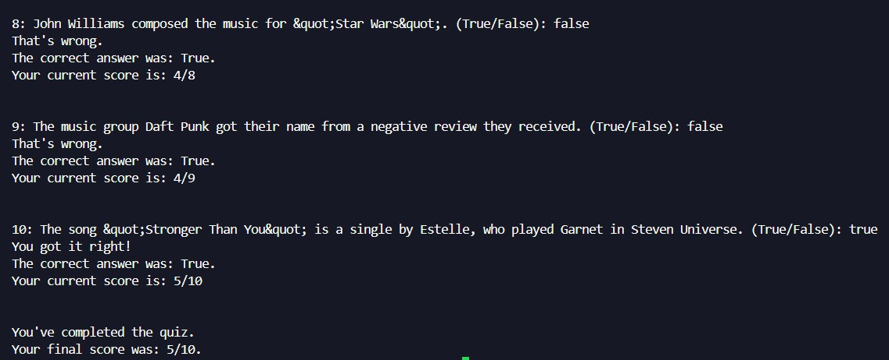

# 🚀 Day 17 - The Quiz Game & The Benefits of OOP
100 Days of Code - Python Bootcamp (Day 17)

This repository contains **Day 17** code of the [100 Days of Code: The Complete Python Pro Bootcamp](https://www.udemy.com/course/100-days-of-code/?couponCode=KEEPLEARNINGBR) course by Angela Yu on Udemy.

### Key Concepts Covered:
- Creating Classes and objects
- Creating Attributes and methods
- How to use the classes

## 🎯 The Quiz Game

